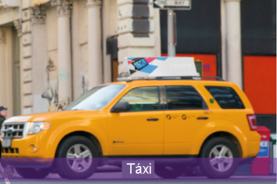
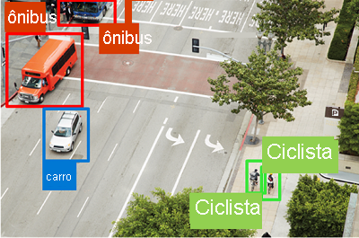
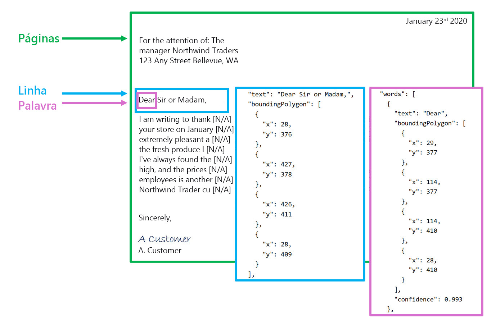
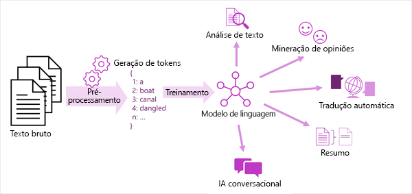

# Exame AI-900

Anotações de Estudo para o Exame AI-900 - Azure AI Fundamentals.  
Veja as referências para o exame em: <https://learn.microsoft.com/pt-br/credentials/certifications/azure-ai-fundamentals>

## Conceitos Fundamentais de IA

### O que é IA

IA é um software que imita comportamentos e funcionalidades humanas. Pricipais workloads e funcionalidades da IA:

- **Machine learning**: base de um sistema de IA; é como "ensinamos" a IA a fazer previsões e tirar conclusões com base em dados.
- **Pesquisa Visual Computacional (Computer vision)**: interpretar o mundo visualmente por meio de câmeras, vídeos e imagens.
- **Processamento de linguagem natural (NLP - Natural Language Processing)**: interpretar a linguagem escrita ou falada e responder da mesma forma.
- **Inteligência de documentos (Document intelligence)**: lidar com o gerenciamento, o processamento e o uso de grandes volumes de dados de formulários e documentos.
- **Mineração de conhecimento (Knowledge mining)**: extrair informações de grandes volumes de dados, muitas vezes não estruturados, para criar um repositório de conhecimento pesquisável.
- **IA Generativa (Generative AI)**: criação de conteúdo original em formatos como linguagem natural, imagem, código e outros.

### Noções básicas sobre machine learning

- a maioria dos aplicativos modernos de IA derivam do machine learning;
- ramo da IA que integra ciência da computação e matemática;
- os computadores aprendem com base nos dados;
- cientistas de dados podem usar os dados para treinar modelos de machine learning que podem fazer previsões e inferências com base nas relações encontradas nos dados.

#### Estúdio do Azure Machine Learning (Azure Machine Learning Studio)

Serviço do **Azure Machine Learning** para criar, gerenciar e publicar modelos de machine learning.

- **Machine learning automatizado** (Automated machine learning): permite que quem não é especialista crie rapidamente um modelo de machine learning eficaz com base nos dados.
- **Designer do Azure Machine Learning** (Azure Machine Learning designer): interface gráfica que permite o desenvolvimento sem código de soluções de machine learning.
- **Visualização de métricas de dados** (Data metric visualization): analisar e otimizar seus experimentos com visualização.
- **Notebooks**: escreva e execute seu próprio código em servidores gerenciados do Jupyter Notebook integrados ao estúdio.

### Noções básicas sobre a Pesquisa Visual Computacional

- área da IA que lida com o processamento visual;
- baseia-se em modelos de machine learning que podem ser aplicados à entrada visual de câmeras, vídeos ou imagens;
- tarefas comuns da Pesquisa Visual Computacional:
  - **Classificação de imagens** - classificar imagens com base no conteúdo delas;  
  
  - **Detecção de objetos** - classificar objetos individuais dentro de uma imagem e identificar a localização deles com uma caixa delimitadora;  
  
  - **Segmentação semântica** - pixels individuais na imagem são classificados de acordo com o objeto ao qual eles pertencem, por ex.: realçar em uma imagem veículos diferentes usando cores específicas;  
  
  - **Análise de imagem** - combinar modelos de machine learning com técnicas avançadas de análise de imagem para extrair informações de imagens como TAGs ou legendas descritivas sobre a cena mostrada na imagem;  
  
  - **Detecção, análise e reconhecimento facial** - forma especializada de detecção de objetos que localiza faces humanas em uma imagem, podendo reconhecer pessoas com base em seus traços (análise de geometria facial);  
  
  - **OCR (reconhecimento óptico de caracteres)** - detectar e ler texto em imagens: ler texto em fotografias; extrair informações de documentos digitalizados.  
  

#### Estúdio do Visão do Azure (Azure Vision Studio)

Serviço de **Visão de IA do Azure** (Azure AI Vision) para desenvolver soluções de visão computacional.

- **Análise de imagens** (Image Analysis): analisar imagens e vídeos e extrair descrições, marcas, objetos e textos.
- **Detecção Facial** (Face): permite criar soluções de detecção e reconhecimento facial.
- **Reconhecimento óptico de caracteres** (**OCR** - Optical Character Recognition): extrair texto impresso ou manuscrito de imagens, permitindo o acesso a uma versão digital do texto verificado.

### Noções básicas sobre o Processamento de Linguagem Natural (NLP)

- área da IA que lida com a criação de software que entende o idioma escrito e falado;
- NLP permite criar um software que pode:
  - Analisar e interpretar o texto em documentos, mensagens de email e outras fontes;
  - Interpretar o idioma falado e sintetizar as respostas de fala;
  - Traduzir automaticamente frases faladas ou escritas entre idiomas;
  - Interpretar comandos e determinar as ações apropriadas.

#### Estúdio de Linguagem do Azure (Azure Language Studio)

Serviço de **Linguagem de IA do Azure** (Azure AI Language) para criar soluções de processamento de linguagem natural.

- compreensão e análise de texto;
- treinamento de modelos de linguagem de conversa que podem entender comandos falados ou baseados em texto;
- criação de aplicativos inteligentes.

#### Estúdio de Fala do Azure (Azure Speech Studio)

Serviço de **Fala de IA do Azure** (Azure AI Speech) é outro serviço para criar soluções de processamento de linguagem natural.

- reconhecimento de fala e síntese;
- traduções em tempo real;
- transcrições de conversas e muito mais.

### Noções básicas sobre Inteligência de documentos

- área da IA que trata do gerenciamento, processamento e uso de grandes volumes de dados diversos encontrados em formulários e documentos;
- permite criar um software que possa automatizar o processamento de contratos, documentos de saúde, formulários financeiros e muito mais.

#### Estúdio de Informação de Documentos (Document Intelligence Studio)

Serviço de **IA do Azure para Informação de Documentos** (Azure AI Document Intelligence) para criar soluções que gerenciam e aceleram a coleta de dados de documentos verificados.

- ajudam a automatizar o processamento de documentos em aplicativos e fluxos de trabalho, aprimorar estratégias orientadas por dados e enriquecer recursos de pesquisa de documentos;
- processamento de IA em modelos predefinidos como faturas, recibos, cartões de planos de saúde, formulários fiscais e muito mais;
- também em modelos personalizados com seus próprios conjuntos de dados rotulados.

### Noções básicas sobre Mineração de conhecimento

- A mineração de conhecimento é o termo usado para descrever soluções que envolvem a extração de informações de grandes volumes de dados geralmente não estruturados, com o objetivo de criar um repositório de conhecimento pesquisável.
  - indexação de documentos não pesquisáveis anteriormente
  - extração e a exibição de insights de grandes volumes de dados rapidamente

#### Pesquisa de IA do Azure (Azure AI Search)

Uma das soluções de mineração de conhecimento da Microsoft para pesquisa corporativa que possui ferramentas para criar índices. Os índices podem então ser usados apenas para uso interno ou para permitir conteúdo pesquisável em ativos da Internet voltados ao público.

Pode utilizar os recursos dos serviços de IA do Azure para extrair os dados, como:

- processamento de imagens;
- inteligência de documentos;
- e processamento de linguagem natural.

### Noções básicas sobre a IA Generativa

- categoria de recursos dentro da IA que cria conteúdo original.
- aplicativos de IA generativa recebem entradas de linguagem natural e retornam respostas apropriadas em uma variedade de formatos:
  - linguagem natural
  - imagem
  - código
  - áudio

#### Estúdio do OpenAI do Azure

Serviço **Azure OpenAI** para criar soluções de IA generativa. Reúne modelos e APIs de ponta da OpenAI com a segurança e a escalabilidade do Azure.

- implantar, personalizar e hospedar modelos de IA generativa, podendo utilizar a interface do usuário do Estúdio do OpenAI do Azure.

### Desafios e riscos com a IA

Como qualquer ferramenta, a IA deve ser usada com responsabilidade. Alguns dos possíveis desafios e riscos enfrentados por um desenvolvedor de aplicativos de IA:

- A tendência (dos dados de treinamento) pode afetar os resultados;
- Erros podem causar danos;
- Os dados (sensíveis/confidênciais) podem ser expostos se armazenados de forma insegura;
- As soluções podem não funcionar para todos (acessibilidade);
- Os usuários devem confiar em um sistema complexo;
- Quem é responsável por decisões baseadas em IA?

### Noções básicas sobre a IA responsável

O desenvolvimento de software de IA, na Microsoft, é guiado por um conjunto de seis princípios, para garantir aplicativos de IA sem consequências negativas involuntárias:

- **Imparcialidade**: sistemas de IA devem tratar todas as pessoas de maneira justa. O Azure Machine Learning inclui a capacidade de interpretar modelos e quantificar a medida em que cada recurso dos dados influencia a previsão do modelo.
- **Confiabilidade e segurança**: sistemas de IA devem ser executados de maneira confiável e segura. Software baseado em IA deve estar sujeito a rigorosos processos de gerenciamento de implantação e teste, para verificar se funcionam conforme o esperado antes do lançamento.
- **Privacidade e segurança**: sistemas de IA devem ser seguros e respeitar a privacidade. Tanto os dados como as decisões tomadas com base nos dados podem estar sujeitos a questões de privacidade ou segurança.
- **Inclusão**: sistemas de IA devem capacitar todos e envolver as pessoas, levando benefícios a todas as camadas da sociedade.
- **Transparência**: sistemas de IA devem ser compreensíveis - usários cientes da finalidade do sistema, de como ele funciona e quais limitações podem ser esperadas.
- **Responsabilidade**: As pessoas devem ser responsáveis pelos sistemas de IA - estrutura de governança e de princípios organizacionais que garantam que a solução cumpra a padrões éticos e legais claramente definidos.

## Princípios básicos do aprendizado de máquina (Machine Learning)

O aprendizado de máquina é, em muitos aspectos, a interseção de duas disciplinas: ciência de dados e engenharia de software. O objetivo do aprendizado de máquina é utilizar dados para criar um modelo preditivo que possa ser incorporado a um aplicativo ou serviço de software.

O aprendizado de máquina tem suas origens na estatística e na modelagem matemática de dados. A ideia fundamental do aprendizado de máquina é utilizar dados de observações passadas para prever resultados ou valores desconhecidos.

### O aprendizado de máquina como uma *função*

Um modelo de aprendizado de máquina é um aplicativo de software que encapsula uma **função** para calcular um valor de saída com base em um ou mais valores de entrada.

- **treinamento**: processo de definição da função que será utilizada pelo modelo de machine learning;
- **inferência**: processo de utilização da *funcão* para prever novos valores de dados.

Etapadas envolvidas no *treinamento* e na *inferência*:  


- **1.** Os dados de treinamento consistem em observações passadas, incluindo nessas observaçoes:
  - *recursos*: atributos do objeto que está sendo observado, referidos como ***x***
  - *rótulo*: é o valor conhecido do objeto que você deseja treinar um modelo para prever, referidos como ***y***
- **2.** Um *algoritmo* é aplicado aos dados para tentar determinar um relacionamento entre os *recursos* e o *rótulo* e generalizar esse relacionamento como um cálculo que pode ser executado em ***x*** para calcular ***y***. O princípio básico é tentar ajustar uma *função* aos dados, na qual os valores dos recursos podem ser usados para calcular o rótulo.
- **3.** O resultado do algoritmo é um *modelo* que encapsula o cálculo derivado pelo algoritmo como uma função ***f*** : *`y = f(x)`*
- **4.** O modelo treinado pode então ser utilizado para *inferência*: dar entrada em um conjunto de valores de recursos e receber como saída uma previsão do rótulo correspondente.

Para exemplificar de forma simples, vamos considerar os cenários abaixo:

- Cenário de vendas de sorvete: treinar um modelo que possa prever o número de vendas de sorvete com base na previsão do tempo. As medidas meteorológicas do dia (temperatura, precipitação, velocidade do vento etc.) serão os *recursos* (**x**), e o número de sorvetes vendidos em cada dia será o *rótulo* (**y**).
- Cenário médico: prever se um paciente está ou não em risco de diabetes com base nas suas medições clínicas. As medidas do paciente (peso, nível de glicose no sangue etc.) são *recursos* (**x**), e a probabilidade de diabetes (por exemplo, 1 para em risco, 0 para sem risco) é o *rótulo* (**y**).
- Cenário de pesquisa na Antártica: prever a espécie de um pinguim com base em seus atributos físicos. As principais medidas do pinguim (comprimento das nadadeiras, largura do bico e assim por diante) são os *recursos* (**x**) e a espécie (por exemplo, 0 para Adélia, 1 para Gentoo ou 2 para Chinstrap) é o *rótulo* (**y**).

### Tipos de aprendizado de máquina

Aplicar o tipo apropriado de Machine Learning depende do que você está tentando prever. Tipos comuns de aprendizado de máquina:  


#### Machine Learning supervisionado

Algoritmos de aprendizado de máquina em que os dados de treinamento incluem valores de recursos e valores conhecidos de rótulo. Utilizado para treinar modelos determinando um relacionamento entre os recursos e os rótulos em observações passadas, de modo que rótulos desconhecidos possam ser previstos para recursos em casos futuros.

- **Regressão**: tipo em que o rótulo previsto pelo modelo é um valor numérico.
- **Classificação**: tipo em que o rótulo representa uma categorização, ou classe. Existem dois tipos comuns de classificação:
  - *Classificação binária*: o rótulo determina se o item observado *é* (ou *não é*) uma instância de uma classe específica - um de dois resultados mutuamente exclusivos (V/F).
  - *Classificação multiclasse*: prever um rótulo que representa uma das várias classes possíveis - utilizada para prever rótulos (várias classes) mutuamente exclusivos, além de algoritmos para treinar modelos de classificação com vários rótulos concomitantes.

#### Machine Learning não supervisionado

Envolve o treinamento de modelos usando dados que consistem apenas em valores de recursos sem rótulos conhecidos. Determinam relacionamentos entre os recursos das observações nos dados de treinamento.

- **Clustering**: Um algoritmo de clustering identifica semelhanças entre observações com base nos seus recursos e as agrupa em clusters discretos. Diferente do que ocorre na classificação, no clustering, não existe um rótulo de cluster previamente conhecido e o algoritmo agrupa as observações de dados com base puramente na similaridade dos recursos. Em alguns casos, o clustering é utilizado para determinar o conjunto de classes existentes antes de treinar um modelo de classificação. Cenários de exemplo:
  - Agrupe flores semelhantes com base no tamanho, no número de folhas e no número de pétalas.
  - Identificar os grupos de clientes semelhantes com base nos atributos demográficos e no comportamento de compra.

### Regressão

Os modelos de regressão são treinados para prever valores numéricos de rótulo com base em dados de treinamento que incluem recursos e rótulos conhecidos.

Quatro elementos-chave do processo de **treinamento** de modelos de machine learning supervisionados:


1. Criar um conjunto de dados com o qual treinar o modelo, mantendo um subconjunto dos dados que você usará para validar o modelo treinado.
2. Usar um algoritmo para ajustar os dados de treinamento a um modelo, como *regressão linear* para um algortimo de regressão.
3. Use os dados de validação retidos para testar o modelo prevendo rótulos dos recursos.
4. Compare os *rótulos reais* conhecidos no conjunto de dados de validação com os *rótulos previstos* pelo modelo. Em seguida, agregue as diferenças entre os valores de rótulo *previstos* e *reais* para calcular uma métrica que indica a precisão do modelo previsto para os dados de validação.

Após cada treinamento, validação e iteração de avaliação, você pode repetir o processo com diferentes algoritmos e parâmetros até que uma métrica de avaliação aceitável seja alcançada.

#### Métricas de avaliação de regressão

Métricas comuns calculadas com base nas diferenças entre os valores previstos e reais, na avaliação de modelos de regressão.

- **MAE (Erro Médio Absoluto)**: erro absoluto para cada previsão, independe se a previsão estava acima ou abaixo do valor real (ex.: 3 ou -3 indicam variação de 3).
- **EQM (erro quadrático médio)**: uma maneira de produzir uma métrica que "amplifica" erros maiores, elevando ao quadrado os erros individuais e calculando a média dos valores quadrados.
- **REQM (Raiz do Erro Quadrático Médio)**: métrica calculada a partir da raiz quadrada do EQM, utilizada para medir o erro em termos de quantidade e também levando em conta a magnitude dos erros.
- **Coeficiente de determinação (R²)**: métrica que mede a proporção de variação nos resultados de validação que podem ser explicados pelo modelo, em oposição a algum aspecto anômalo dos dados de validação.

Após várias iterações (**treinamento iterativo**), o modelo que resulta na melhor métrica de avaliação aceitável para o cenário específico é selecionado.

### Classificação Binária

Os algoritmos de *classificação binária* são usados para treinar um modelo que prevê um dos dois rótulos possíveis para uma única classe. Basicamente, a previsão de **verdadeiro** ou **falso**: vários valores de *recurso* (***x***) e um *rótulo* (***y***) que é **1** ou **0**.

Há muitos algoritmos que podem ser usados para classificação binária, como **regressão logística**, que deriva uma função sigmoide (em forma de S) com valores entre *0,0* e *1,0*.

#### Métricas de avaliação de classificação binária

Primeiro deve-se criar uma matriz do número de previsões corretas e incorretas, chamada **Matriz de confusão**:

- Verdadeiramente negativos (TN)
- Falsos positivos (FP)
- Falsos negativos (FN)
- Verdadeiramente positivos (TP)

Métricas de avaliação:

- **Exatidão**: a proporção de previsões que o modelo acertou.
- **Recall**: a proporção de casos positivos identificados corretamente pelo modelo.
- **Precisão**: a proporção de casos positivos previstos em que o rótulo verdadeiro é realmente positivo.
- **Medida F1**: é uma métrica geral que combina recall e precisão.
- **Área sob a curva (AUC)**

### Classificação Multiclasse

Os algoritmos de *classificação multiclasse* são utilizados para calcular valores de probabilidades para rótulos de várias classes, habilitando um modelo a prever a classe *mais provável* para uma determinada observação.  
Segue o mesmo processo iterativo *treinar*, *validar* e *avaliar* que a regressão e a classificação binária, no qual um subconjunto dos dados de treinamento é retido para validar o modelo treinado.

Existem dois tipos de algoritmo para treinar um modelo de classificação multiclasse:

- **Algoritmos One-vs-Rest (OvR)**: treinam uma função de classificação binária para cada classe. Um modelo treinado utilizando esse tipo de algoritmo prevê a classe de acordo com a função que produzir a saída de maior probabilidade.
- **Algoritmos multinomiais**: cria uma única função que retorna uma saída com vários valores, um *vetor* que contém a distribuição de probabilidades para todas as classes possíveis (por ex.: função *softmax*).

Você pode avaliar um classificador multiclasse calculando as métricas de classificação binária para cada classe individual. Alternativamente, você pode calcular as métricas de agregação que levam em conta todas as classes.

### Clustering

Esse tipo de machine learning é considerado não supervisionado porque não usa valores de rótulos conhecidos anteriormente para treinar um modelo. Em um modelo de clustering, o rótulo é o cluster ao qual a observação é atribuída com base apenas em seus recursos.

Há vários algoritmos que você pode usar para clustering. Um dos algoritmos mais usados é o cluster **K-means**.

Como não há um rótulo conhecido com o qual comparar as atribuições de cluster previstas, a avaliação de um modelo de clustering se baseia em quão bem os clusters resultantes são separados uns dos outros. Algumas métricas utilizadas para avaliar a separação de cluster:

- **Distância média para o centro do cluster**
- **Distância média para o outro centro**
- **Distância máxima até o centro do cluster**
- **Silhueta**

### Deep Learning (Aprendizado Profundo)

O *Deep Learning* é uma forma avançada de aprendizado de máquina que tenta emular a maneira como o cérebro humano aprende. A chave para o *aprendizado profundo* é a criação de uma *rede neural* artificial que simula a atividade eletroquímica em neurônios biológicos utilizando funções matemáticas.

As redes neurais artificiais são compostas de várias camadas de neurônios - essencialmente definindo uma função profundamente aninhada, por esse motivo esses modelos são frequentemente chamados de *redes neurais profundas* (DNNs).

Podem ser utilizadas para muitos tipos de problemas de aprendizado de máquina como regressão e classificação, bem como modelos mais especializados para processamento de linguagem natural e pesquisa visual computacional.

O aprendizado profundo também envolve o ajuste dos dados de treinamento a uma função que pode prever um *rótulo* (***y***) com base no valor de um ou mais *recursos* (***x***)

### Azure Machine Learning

Serviço do Azure para gerenciar o ciclo de vida de ponta a ponta de projetos de machine learning:

- Exploração de dados e preparação para modelagem.
- Treinamento e avaliação de modelos de machine learning.
- Registro e gerenciamento de modelos treinados.
- Implantação de modelos treinados para uso por aplicativos e serviços.
- Revisão e aplicação de princípios e práticas de IA responsáveis.

O principal recurso necessário para o Azure Machine Learning é um *workspace do Azure Machine Learning*, que você pode provisionar em uma assinatura do Azure.

## Conceitos básicos dos serviços de IA do Azure (Azure AI Services)

Os serviços de IA do Azure foram projetados para serem usados em diferentes ambientes de desenvolvimento, com codificação mínima. Os desenvolvedores podem acessar os serviços de IA por meio de APIs REST, bibliotecas de clientes ou integrá-los a ferramentas como Aplicativos Lógicos e Power Automate.

Existem dois tipos de recursos dos serviços de IA: *multisserviço* ou *serviço único*. Requisitos de desenvolvimento e a forma como você deseja que os custos sejam cobrados determinam os tipos de recursos necessários.

- **Recurso multisserviço**: use o recurso **serviços de IA do Azure** para obter acesso a vários serviços de IA do Azure com uma só chave e ponto de extremidade (*endpoint*). Nesse caso todos os seus serviços de IA serão cobrados juntos.
- **Recurso de serviço único**: recurso com acesso a um serviço determinado de IA do Azure, com uma chave e um ponto de extremidade (*endpoint*) exclusivos. Indicado quando precisa obter apenas um serviço de IA ou deseja ver as informações de custo separadamente.

Depois de compilar um recurso de serviço de IA do Azure, você pode criar aplicativos usando a API REST, kits de desenvolvimento de software (SDKs) ou interfaces de estúdio visual.

Antes de usar um recurso de serviço de IA, você deve associá-lo ao estúdio que deseja usar na página *Configurações*, selecionando o recurso e selecionando **Usar Recurso**.

Quando você escreve código para acessar o serviço de IA, as *chaves* e o *ponto de extremidade* (URL por ex.: ```https://myaiservices29.cognitiveservices.azure.com```) precisam ser incluídos no cabeçalho da autenticação. Quando você usa uma interface de estúdio com os serviços de IA do Azure, suas credenciais são autenticadas quando você faz login, e um processo semelhante acontece em segundo plano.

## Fundamentos da Pesquisa Visual Computacional (Computer Vision)

Uma das arquiteturas de modelos de machine learning mais comuns para a pesquisa visual computacional é uma **rede neural convolucional (CNN)**. As CNNs usam filtros para extrair mapas de recursos numéricos de imagens e, em seguida, alimentam os valores desses recursos em um modelo de aprendizado profundo para gerar uma previsão de rótulo.

O sucesso dos *transformadores* como forma de criar modelos de linguagem levou os pesquisadores de IA a considerar se essa mesma abordagem seria eficaz para dados de imagem. O resultado é o desenvolvimento de **modelos multimodais**, nos quais o modelo é treinado usando um grande volume de imagens legendadas, sem rótulos fixos. O modelo geral encapsula as relações entre inserções de token de linguagem natural e recursos de imagem.

O modelo **Florence da Microsoft** é um exemplo desses modelos. Treinado com grandes volumes de imagens legendadas da Internet, ele inclui tanto um *codificador de idioma* quanto um *codificador de imagem*.

Você pode usar o *Florence* como um modelo base para modelos adaptáveis que executam:

- *Classificação de imagens*: identifica a categoria à qual uma imagem pertence.
- *Detecção de Objetos*: localiza objetos individuais dentro de uma imagem.
- *Legendas*: gera descrições apropriadas de imagens.
- *Marcação (TAG)*: compila uma lista de marcas de texto relevantes para uma imagem.

O serviço Visão de IA do Azure da Microsoft oferece modelos de pesquisa visual computdisparal pré-construídos e personalizáveis que se baseiam no modelo de base Florence e fornecem vários recursos avançados.

**Serviço Visão de IA do Azure** (criar recurso Único/Multisserviço) > **Estúdio do Visão de IA do Azure**:

- Reconhecimento óptico de caracteres (OCR) - extração de texto de imagens.
- Geração de legendas e descrições de imagens.
- Detecção de milhares de objetos comuns em imagens.
- Marcação de recursos visuais em imagens (tags - metadados - indexar)
- Classificação de imagens
- Detecção de objetos

## Conceitos básicos do reconhecimento facial

A **Detecção Facial** envolve a identificação de regiões de uma imagem que contenham um rosto humano, geralmente retornando coordenadas da caixa delimitadora que formam um retângulo ao redor do rosto, como abaixo:


Com a **Análise da Detecção Facial**, os recursos faciais podem ser utilizados para treinar modelos de machine learning para retornar outras informações, como características faciais como nariz, olhos, sobrancelhas, lábios e outros. Podendo até identificar indivíduos conhecidos com base nos traços do rosto deles, sso é conhecido como *Reconhecimento da Detecção Facial*. O **Serviço Detecção Facial de IA do Azure** fornece modelos pré-treinados para detectar, reconhecer e analisar rostos.

Qualquer pessoa pode usar o serviço de Detecção Facial para:

- Detectar a localização de rostos em uma imagem.
- Determinar se a pessoa está usando óculos.
- Determinar se existe oclusão, desfoque, ruído ou exposição excessiva ou insuficiente em qualquer um dos rostos.
- Retornar as coordenadas da pose da cabeça para cada rosto em uma imagem.

A *política de Acesso Limitado* exige que os clientes enviem um formulário de admissão para acessar recursos adicionais do serviço de Detecção Facial da IA do Azure, incluindo:

- Capacidade de comparar a similaridade de rostos.
- Capacidade de identificar indivíduos nomeados em uma imagem.

Algumas considerações na detecção nas imagens:

- **Formato de imagem**: suportados JPEG, PNG, GIF e BMP.
- **Tamanho do arquivo**: 6 MB ou menos.
- **Intervalo de tamanho do rosto**: de 36 x 36 pixels até 4096 x 4096 pixels

## Princípios básicos do reconhecimento óptico de caracteres (OCR)

A capacidade dos sistemas de computação de processar textos escritos e impressos é uma área da IA em que a *pesquisa visual computacional* se cruza com o *processamento de linguagem natural*. As funcionalidades do Visão são necessárias para "leitura" do texto e, em seguida, as funcionalidades de processamento de linguagem natural dão sentido a ele.

O **OCR** é a base do processamento de textos em imagens e usa modelos de machine learning treinados para reconhecer formas individuais como letras, numerais, sinais de pontuação ou outros elementos de texto.

A *API de Leitura* (conhecida como *mecanismo OCR de Leitura*) da **Visão de IA do Azure** é o mecanismo OCR por trás da extração de texto de imagens, PDFs e arquivos TIFF.

Chamar a *API de Leitura* retorna os resultados organizados na seguinte hierarquia:

- **Páginas**: uma para cada página de texto, incluindo informações sobre o tamanho e a orientação da página.
- **Linhas**: as linhas de texto em uma página.
- **Palavras**: palavras em uma linha de texto.

Cada linha e palavra inclui coordenadas de caixa delimitadora indicando sua posição na página.



Depois que você cria um recurso (Visão de IA do Azure; Serviços de IA do Azure), há várias maneiras de usar a API de Leitura da Visão de IA do Azure:

- Azure Vision Studio
- API REST
- SDKs (Software Development Kits): Python, C#, JavaScript

## Conceitos básicos da Análise de Texto com o Serviço de Linguagem

Para que interpretem o assunto de um texto de forma semelhante aos humanos, os sistemas de computador usam o **processamento de linguagem natural (NLP)**, uma área dentro da IA que trata da compreensão da linguagem escrita ou falada e de como responder à altura. A *análise de texto* descreve os processos de NLP que extraem informações de textos não estruturados.

A **Linguagem de IA do Azure** é um serviço em nuvem que inclui vários recursos que dão suporte à análise de sentimentos, à identificação de frases-chave, aos resumos de texto e a entender a linguagem de conversação.

Algumas das primeiras técnicas usadas para analisar texto com computadores envolvem a análise estatística de um corpo de texto (um *corpus*) para inferir algum tipo de significado semântico. A primeira etapa na análise de um corpus é dividi-lo em *tokens*. Para simplificar, você pode pensar em cada palavra distinta no texto de treinamento como um token, mas podem ser gerados para palavras parciais ou combinações de palavras e pontuação.

Dependendo do tipo específico de problema de NLP, os seguintes conceitos podem se aplicar à geração de tokens:

- **Normalização de texto**
- **Remoção de palavra irrelevante (stop word: *o*, *a* ou *uns*)**
- **n-gramas**
- **lematização**

Depois de gerar os *tokens* das palavras, você pode executar algumas análises para contar o número de ocorrências de cada token. As palavras mais usadas muitas vezes podem fornecer uma pista sobre o assunto principal de um *corpus* de texto.

Uma técnica útil de análise de texto é usar um algoritmo de classificação, como ***regressão logística***, para treinar um modelo de machine learning que classifica o texto com base em um conjunto conhecido de categorizações. Uma aplicação comum dessa técnica é treinar um modelo que classifica o texto como *positivo* ou *negativo* para executar a *análise de sentimento* ou a *mineração de opiniões*.

Entre as tarefas comuns de NLP compatíveis com modelos de linguagem incluem-se:

- **Análise de texto**: como extrair termos chave ou identificar entidades nomeadas no texto.
- **Análise de sentimento e mineração de opiniões**: categorizar o texto como *positivo* ou *negativo*; retorna:
  - Sentimento do documento
  - Pontuações de sentimento em três categorias: positivo, neutro e negativo
- **Tradução automática**: o texto é convertido automaticamente de um idioma para outro.
- **Sumarização**: os principais pontos de um grande corpo de texto são resumidos.
- **Soluções de IA de conversação**: como *bots* ou *assistentes digitais*, nas quais o modelo de linguagem pode interpretar a entrada de linguagem natural e retornar uma resposta apropriada.



## Conceitos básicos das respostas às perguntas com o Serviço de Linguagem

A **resposta a perguntas** dá suporte a cargas de trabalho de IA de linguagem natural que exigem um elemento de conversa automatizada. Normalmente, a resposta a perguntas é usada para criar *aplicativos de bot* que respondem a consultas de clientes. Os bots podem ser implementados em plataformas como um site ou uma rede social.

Dois serviços principais para criar uma solução de bot para o suporte ao usuário no Microsoft Azure:

- **Linguagem de IA do Azure**: inclui um recurso de resposta às perguntas personalizadas, que permite definir uma *base de conhecimento* de pares de pergunta e resposta que podem ser consultados usando entrada de linguagem natural.
- **Serviço de Bot de IA do Azure**: oferece uma estrutura para desenvolver, publicar e gerenciar bots no Azure.

Depois de provisionar um recurso de linguagem, você poderá usar o recurso de resposta a perguntas personalizadas do Estúdio de Linguagem para criar um projeto que consiste em pares de perguntas e respostas. Essas perguntas podem ser:

- Geradas com base em um documento existente de perguntas frequentes ou uma página da Web.
- Inseridas e editadas manualmente.

Você pode usar a interface de teste interna no Language Studio para testar sua base de dados de conhecimento enviando perguntas e revisando as respostas retornadas.

Depois de criar e implantar uma base de dados de conhecimento, você pode disponibilizá-la aos usuários por meio de um bot. A abordagem mais fácil é usar a funcionalidade de criação automática de bot, que permite criar um bot para a sua base de dados de conhecimento implantada e publicá-lo como um aplicativo do **Serviço de Bot de IA do Azure** com apenas alguns cliques.

Quando o bot estiver pronto para ser entregue aos usuários, você poderá conectá-lo a vários *canais*, possibilitando que os usuários interajam com ele por meio do Webchat, do email, do Microsoft Teams e de outras mídias de comunicação comuns.

## Conceitos básicos da compreensão da linguagem coloquial (conversational language)

O Microsoft Azure suporta a *compreensão da linguagem coloquial* por meio do serviço de **Linguagem de IA do Azure**, compreendendo muitos tipos de tarefas que envolvem comando e controle, conversa de ponta a ponta e suporte corporativo. Um exemplo disso seria um aplicativo capaz de ativar e desativar dispositivos com base na fala.

A *compreensão da linguagem coloquial* leva em conta três conceitos principais:

- **Enunciados**: algo que um usuário poderá dizer e que seu aplicativo deverá interpretar.
  - *Ligar as luzes*; *Ligar o ventilador*
- **Entidades**: é um item ao qual um enunciado se refere, como *ventilador* e *luz* nos enunciados acima.
- **Intenções**: representa a finalidade ou meta expressada no enunciado de um usuário, nos enunciados acima a intenção é *ligar* um dispositivo.

Um aplicativo de compreensão da linguagem coloquial define um modelo que consiste em *intenções* e *entidades*. Os *enunciados* são usados para treinar o modelo com o objetivo de identificar a intenção e as entidades mais prováveis às quais ele será aplicado.

A intenção ***None*** tem uma importância exclusiva, para ajudar a lidar com enunciados que não mapeiam nenhum dos enunciados inseridos por você, nesse caso, sendo utilizada para fornecer uma resposta genérica aos usuários.

A compreensão da linguagem coloquial fornece uma coleção abrangente de *domínios* predefinidos que incluem *intenções* e *entidades* predefinidas para cenários comuns. Você poderá usá-los como ponto de partida para seu modelo. Também será possível criar suas entidades e intenções. É possível escrever códigos para definir os elementos do modelo, mas, na maioria dos casos, é mais fácil criar o modelo usando o **Estúdio de Linguagem do Azure**.

Depois de definir as intenções e as entidades no modelo, bem como incluir um conjunto adequado de enunciados de exemplo, a próxima etapa será treinar o modelo. Treinamento é o processo de usar enunciados de exemplo para ensinar seu modelo a combinar as expressões de linguagem natural que um usuário poderá dizer com prováveis intenções e entidades.

Depois de treinar o modelo, será possível fazer um teste enviando um texto e analisando as intenções previstas. O treinamento e o teste são processos iterativos. Após, você poderá publicar seu aplicativo de Compreensão da Linguagem Coloquial em um recurso de previsão para consumo.

Os aplicativos cliente poderão usar o modelo ao se conectar ao ponto de extremidade do recurso de previsão, especificar a chave de autenticação apropriada, bem como ao enviar a entrada do usuário para obter intenções e entidades previstas. As previsões serão retornadas para o aplicativo cliente que poderá executar a ação apropriada com base na intenção prevista.

## Princípios básicos da Fala de IA do Azure (Azure AI Speech)

A **Fala de IA do Azure** fornece recursos de conversão de *fala em texto* e conversão de *texto em fala* por meio de reconhecimento de fala e síntese.

- **Reconhecimento de Fala**: a capacidade de detectar e interpretar a entrada falada
- **Sintetização de voz**: a capacidade de gerar uma saída falada

O **reconhecimento de fala** usa a palavra falada e a converte em dados que podem ser processados, muitas vezes transcrevendo-a em texto, tendo como fonte uma voz gravada em um arquivo de áudio ou em um áudio ao vivo de um microfone. Para fazer isso, o software normalmente usa vários modelos:

- Um *modelo acústico* que converte o sinal de áudio em fonemas.
- Um *modelo de linguagem* que transforma os fonemas em palavras, geralmente usando um algoritmo estatístico.

Várias finalidades no reconhecimento de fala:

- Fornecer legendas ocultas para vídeos gravados ou ao vivo.
- Criar uma transcrição de uma chamada telefônica ou de uma reunião.
- Ditado de anotação automatizada.
- Determinar a entrada do usuário pretendida para obter um processamento adicional.

A **síntese de fala** trata da vocalização de dados, geralmente convertendo texto em fala. Uma solução de sintetização de voz normalmente requer as seguintes informações:

- O texto a ser falado.
- A voz a ser usada para vocalizar a fala.

Várias finalidades para sintetização de voz:

- Gerar respostas faladas para a entrada do usuário.
- Criar menus de voz para sistemas telefônicos.
- Ler mensagens de email ou texto em voz alta em cenários de mãos livres.
- Difundir comunicados em locais públicos, como estações ferroviárias ou aeroportos.

O Microsoft Azure oferece funcionalidades de reconhecimento de fala e sintetização de voz por meio do serviço de **Fala de IA do Azure**, que inclui as seguintes APIs:

- API de **Conversão de Fala em Texto**
  - transcrição em tempo real
  - transcrição em lote
- API de **Conversão de Texto em Fala**
  - reproduzida de modo direto por meio de um alto-falante de computador
  - gravada em um arquivo de áudio
  - vozes predefinidas, compatíveis com diversos idiomas e pronúncias regionais
  - possibilidade de desenvolver vozes personalizadas

## Princípios básicos da IA do Azure para Informação de Documentos (Azure AI Document Intelligence)

A **IA do Azure para Informação de Documentos** dá suporte a recursos que podem analisar documentos e formulários com modelos predefinidos e personalizados.

A Informação de Documentos depende de modelos de machine learning treinados para reconhecer dados em texto. A capacidade de extrair pares de texto, layout e chave-valor é conhecida como *análise de documentos*. A análise de documentos fornece locais de texto em uma página identificados por coordenadas de caixas delimitadoras.

A IA do Azure para Informação de Documentos consiste em recursos agrupados por tipos de modelo:

- **Modelos predefinidos**: modelos pré-treinados criados para processar tipos de documentos comuns, como faturas, cartões de visita, documentos de identificação e outros.
- **Modelos personalizados**: podem ser treinados para identificar campos específicos que não estão incluídos nos modelos pré-treinados existentes.
- **Análise de documentos**: análise geral de documentos que retorna representações de dados estruturados.

Você pode começar a treinar modelos no **Estúdio de Informação de Documentos**, uma interface de usuário para testar a análise de documentos, modelos predefinidos e criar modelos personalizados.

## Conceitos básicos da mineração de conhecimento e da Pesquisa de IA do Azure (Knowledge Mining; Azure AI Search)

A **Pesquisa de IA do Azure** oferece a infraestrutura (SLA de 99,9%) e as ferramentas para criar soluções de pesquisa que extraem dados de uma variedade de documentos estruturados, semiestruturados e não estruturados. Oferece um mecanismo de pesquisa programável criado com base no **Apache Lucene**, uma biblioteca de software de código aberto.

A Pesquisa de IA do Azure vem com os seguintes recursos:

- **Dados de qualquer fonte**: fornecidos no formato JSON.
- **Pesquisa e análise de texto completo**: tanto para consultas simples quanto para sintaxe de consulta Lucene completa.
- **Pesquisa impulsionada por IA**: funcionalidades de IA do Azure incorporadas para análise de imagem e texto (enriquecimento de IA).
  - Habilidades de processamento de linguagem natural
  - Habilidades de processamento de imagem
- **Multilíngue**: análise linguística para 56 idiomas.
- **Habilitado para pesquisa geográfica**: filtragem de pesquisa geográfica com base na proximidade com uma localização física.
- **Experiência do usuário configurável**: preenchimento automático, sugestão automática, paginação e realce de ocorrências.

É importante ressaltar que a Pesquisa de IA do Azure pode utilizar os recursos integrados dos serviços de IA do Azure, como processamento de imagem, extração de conteúdo e processamento de linguagem natural para realizar a mineração de conhecimento de documentos.

Um índice da Pesquisa de IA do Azure pode ser visto como um contêiner de documentos pesquisáveis, uma coleção persistente de documentos JSON. Conceitualmente, você pode considerar um índice como uma tabela, e cada linha da tabela representa um documento. As tabelas nas colunas podem ser pensadas como equivalentes aos campos em um documento. Colunas têm tipos de dados, da mesma forma que os campos nos documentos.

A Pesquisa de IA do Azure permite criar e carregar documentos JSON em um índice de duas maneiras:

- **Método de push**: os dados JSON são enviados por push a um índice de pesquisa por meio da API REST ou do SDK do .NET. O envio de dados por push tem mais flexibilidade, pois não tem nenhuma restrição quanto ao tipo de fonte de dados, à localização nem à frequência de execução.
- **Método de pull**: os indexadores do serviço Pesquisa podem efetuar pull de dados de fontes de dados populares do Azure e, se necessário, exportar esses dados para o JSON, se ainda não estiverem nesse formato.

Depois de criarmos o índice, poderemos executar consultas. As consultas da Pesquisa de IA do Azure podem ser enviadas como uma solicitação de API REST ou HTTP, com a resposta fornecida como JSON. A Pesquisa de IA do Azure dá suporte a dois tipos de sintaxe: simples e Lucene completa. A sintaxe simples abrange todos os cenários comuns de consulta, enquanto o Lucene completo é útil para cenários avançados.

## Conceitos básicos de IA Generativa

## Conceitos básicos do Serviço OpenAI do Azure (Azure OpenAI Service)

## Conceitos básicos da IA generativa responsável

---
Bons estudos!  
***André Carlucci***
