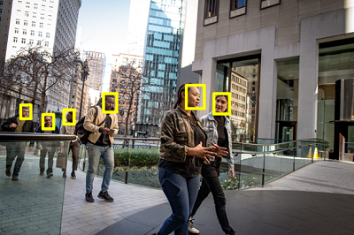

# Exame AI-900

Anotações de Estudo para o Exame AI-900 - Azure AI Fundamentals.  
Veja as referências para o exame em: <https://learn.microsoft.com/pt-br/credentials/certifications/azure-ai-fundamentals>

## Conceitos Fundamentais de IA

### O que é IA

IA é um software que imita comportamentos e funcionalidades humanas. Pricipais workloads e funcionalidades da IA:

- **Machine learning**: base de um sistema de IA; é como "ensinamos" a IA a fazer previsões e tirar conclusões com base em dados.
- **Pesquisa Visual Computacional (Computer vision)**: interpretar o mundo visualmente por meio de câmeras, vídeos e imagens.
- **Processamento de linguagem natural (NLP - Natural Language Processing)**: interpretar a linguagem escrita ou falada e responder da mesma forma.
- **Inteligência de documentos (Document intelligence)**: lidar com o gerenciamento, o processamento e o uso de grandes volumes de dados de formulários e documentos.
- **Mineração de conhecimento (Knowledge mining)**: extrair informações de grandes volumes de dados, muitas vezes não estruturados, para criar um repositório de conhecimento pesquisável.
- **IA Generativa (Generative AI)**: criação de conteúdo original em formatos como linguagem natural, imagem, código e outros.

### Noções básicas sobre machine learning

- a maioria dos aplicativos modernos de IA derivam do machine learning;
- ramo da IA que integra ciência da computação e matemática;
- os computadores aprendem com base nos dados;
- cientistas de dados podem usar os dados para treinar modelos de machine learning que podem fazer previsões e inferências com base nas relações encontradas nos dados.

#### Estúdio do Azure Machine Learning (Azure Machine Learning Studio)

Serviço do **Azure Machine Learning** para criar, gerenciar e publicar modelos de machine learning.

- **Machine learning automatizado** (Automated machine learning): permite que quem não é especialista crie rapidamente um modelo de machine learning eficaz com base nos dados.
- **Designer do Azure Machine Learning** (Azure Machine Learning designer): interface gráfica que permite o desenvolvimento sem código de soluções de machine learning.
- **Visualização de métricas de dados** (Data metric visualization): analisar e otimizar seus experimentos com visualização.
- **Notebooks**: escreva e execute seu próprio código em servidores gerenciados do Jupyter Notebook integrados ao estúdio.

### Noções básicas sobre a Pesquisa Visual Computacional

- área da IA que lida com o processamento visual;
- baseia-se em modelos de machine learning que podem ser aplicados à entrada visual de câmeras, vídeos ou imagens;
- tarefas comuns da Pesquisa Visual Computacional:
  - **Classificação de imagens** - classificar imagens com base no conteúdo delas;  
  
  - **Detecção de objetos** - classificar objetos individuais dentro de uma imagem e identificar a localização deles com uma caixa delimitadora;  
  
  - **Segmentação semântica** - pixels individuais na imagem são classificados de acordo com o objeto ao qual eles pertencem, por ex.: realçar em uma imagem veículos diferentes usando cores específicas;  
  
  - **Análise de imagem** - combinar modelos de machine learning com técnicas avançadas de análise de imagem para extrair informações de imagens como TAGs ou legendas descritivas sobre a cena mostrada na imagem;  
  
  - **Detecção, análise e reconhecimento facial** - forma especializada de detecção de objetos que localiza faces humanas em uma imagem, podendo reconhecer pessoas com base em seus traços (análise de geometria facial);  
  
  - **OCR (reconhecimento óptico de caracteres)** - detectar e ler texto em imagens: ler texto em fotografias; extrair informações de documentos digitalizados.  
  

#### Estúdio do Visão do Azure (Azure Vision Studio)

Serviço de **Visão de IA do Azure** (Azure AI Vision) para desenvolver soluções de visão computacional.

- **Análise de imagens** (Image Analysis): analisar imagens e vídeos e extrair descrições, marcas, objetos e textos.
- **Detecção Facial** (Face): permite criar soluções de detecção e reconhecimento facial.
- **Reconhecimento óptico de caracteres** (**OCR** - Optical Character Recognition): extrair texto impresso ou manuscrito de imagens, permitindo o acesso a uma versão digital do texto verificado.

### Noções básicas sobre o Processamento de Linguagem Natural (NLP)

- área da IA que lida com a criação de software que entende o idioma escrito e falado;
- NLP permite criar um software que pode:
  - Analisar e interpretar o texto em documentos, mensagens de email e outras fontes;
  - Interpretar o idioma falado e sintetizar as respostas de fala;
  - Traduzir automaticamente frases faladas ou escritas entre idiomas;
  - Interpretar comandos e determinar as ações apropriadas.

#### Estúdio de Linguagem do Azure (Azure Language Studio)

Serviço de **Linguagem de IA do Azure** (Azure AI Language) para criar soluções de processamento de linguagem natural.

- compreensão e análise de texto;
- treinamento de modelos de linguagem de conversa que podem entender comandos falados ou baseados em texto;
- criação de aplicativos inteligentes.

#### Estúdio de Fala do Azure (Azure Speech Studio)

Serviço de **Fala de IA do Azure** (Azure AI Speech) é outro serviço para criar soluções de processamento de linguagem natural.

- reconhecimento de fala e síntese;
- traduções em tempo real;
- transcrições de conversas e muito mais.

### Noções básicas sobre Inteligência de documentos

- área da IA que trata do gerenciamento, processamento e uso de grandes volumes de dados diversos encontrados em formulários e documentos;
- permite criar um software que possa automatizar o processamento de contratos, documentos de saúde, formulários financeiros e muito mais.

#### Estúdio de Informação de Documentos (Document Intelligence Studio)

Serviço de **IA do Azure para Informação de Documentos** (Azure AI Document Intelligence) para criar soluções que gerenciam e aceleram a coleta de dados de documentos verificados.

- ajudam a automatizar o processamento de documentos em aplicativos e fluxos de trabalho, aprimorar estratégias orientadas por dados e enriquecer recursos de pesquisa de documentos;
- processamento de IA em modelos predefinidos como faturas, recibos, cartões de planos de saúde, formulários fiscais e muito mais;
- também em modelos personalizados com seus próprios conjuntos de dados rotulados.

### Noções básicas sobre Mineração de conhecimento

- A mineração de conhecimento é o termo usado para descrever soluções que envolvem a extração de informações de grandes volumes de dados geralmente não estruturados, com o objetivo de criar um repositório de conhecimento pesquisável.
  - indexação de documentos não pesquisáveis anteriormente
  - extração e a exibição de insights de grandes volumes de dados rapidamente

#### Pesquisa de IA do Azure (Azure AI Search)

Uma das soluções de mineração de conhecimento da Microsoft para pesquisa corporativa que possui ferramentas para criar índices. Os índices podem então ser usados apenas para uso interno ou para permitir conteúdo pesquisável em ativos da Internet voltados ao público.

Pode utilizar os recursos dos serviços de IA do Azure para extrair os dados, como:

- processamento de imagens;
- inteligência de documentos;
- e processamento de linguagem natural.

### Noções básicas sobre a IA Generativa

- categoria de recursos dentro da IA que cria conteúdo original.
- aplicativos de IA generativa recebem entradas de linguagem natural e retornam respostas apropriadas em uma variedade de formatos:
  - linguagem natural
  - imagem
  - código
  - áudio

#### Estúdio do OpenAI do Azure

Serviço **Azure OpenAI** para criar soluções de IA generativa. Reúne modelos e APIs de ponta da OpenAI com a segurança e a escalabilidade do Azure.

- implantar, personalizar e hospedar modelos de IA generativa, podendo utilizar a interface do usuário do Estúdio do OpenAI do Azure.

### Desafios e riscos com a IA

Como qualquer ferramenta, a IA deve ser usada com responsabilidade. Alguns dos possíveis desafios e riscos enfrentados por um desenvolvedor de aplicativos de IA:

- A tendência (dos dados de treinamento) pode afetar os resultados;
- Erros podem causar danos;
- Os dados (sensíveis/confidênciais) podem ser expostos se armazenados de forma insegura;
- As soluções podem não funcionar para todos (acessibilidade);
- Os usuários devem confiar em um sistema complexo;
- Quem é responsável por decisões baseadas em IA?

### Noções básicas sobre a IA responsável

O desenvolvimento de software de IA, na Microsoft, é guiado por um conjunto de seis princípios, para garantir aplicativos de IA sem consequências negativas involuntárias:

- **Imparcialidade**: sistemas de IA devem tratar todas as pessoas de maneira justa. O Azure Machine Learning inclui a capacidade de interpretar modelos e quantificar a medida em que cada recurso dos dados influencia a previsão do modelo.
- **Confiabilidade e segurança**: sistemas de IA devem ser executados de maneira confiável e segura. Software baseado em IA deve estar sujeito a rigorosos processos de gerenciamento de implantação e teste, para verificar se funcionam conforme o esperado antes do lançamento.
- **Privacidade e segurança**: sistemas de IA devem ser seguros e respeitar a privacidade. Tanto os dados como as decisões tomadas com base nos dados podem estar sujeitos a questões de privacidade ou segurança.
- **Inclusão**: sistemas de IA devem capacitar todos e envolver as pessoas, levando benefícios a todas as camadas da sociedade.
- **Transparência**: sistemas de IA devem ser compreensíveis - usários cientes da finalidade do sistema, de como ele funciona e quais limitações podem ser esperadas.
- **Responsabilidade**: As pessoas devem ser responsáveis pelos sistemas de IA - estrutura de governança e de princípios organizacionais que garantam que a solução cumpra a padrões éticos e legais claramente definidos.

## Princípios básicos do aprendizado de máquina (Machine Learning)

## Conceitos básicos dos serviços de IA do Azure (Azure AI Services)

## Fundamentos da Pesquisa Visual Computacional (Computer Vision)

## Conceitos básicos do reconhecimento facial

## Princípios básicos do reconhecimento óptico de caracteres (OCR)

## Conceitos básicos da Análise de Texto com o Serviço de Linguagem

## Conceitos básicos das respostas às perguntas com o Serviço de Linguagem

## Conceitos básicos da compreensão da linguagem coloquial (conversational language)

## Princípios básicos da Fala de IA do Azure (Azure AI Speech)

## Princípios básicos da IA do Azure para Informação de Documentos (Azure AI Document Intelligence)

## Conceitos básicos da mineração de conhecimento e da Pesquisa de IA do Azure (Knowledge Mining; Azure AI Search)

## Conceitos básicos de IA Generativa

## Conceitos básicos do Serviço OpenAI do Azure (Azure OpenAI Service)

## Conceitos básicos da IA generativa responsável

---
Bons estudos!  
***André Carlucci***
